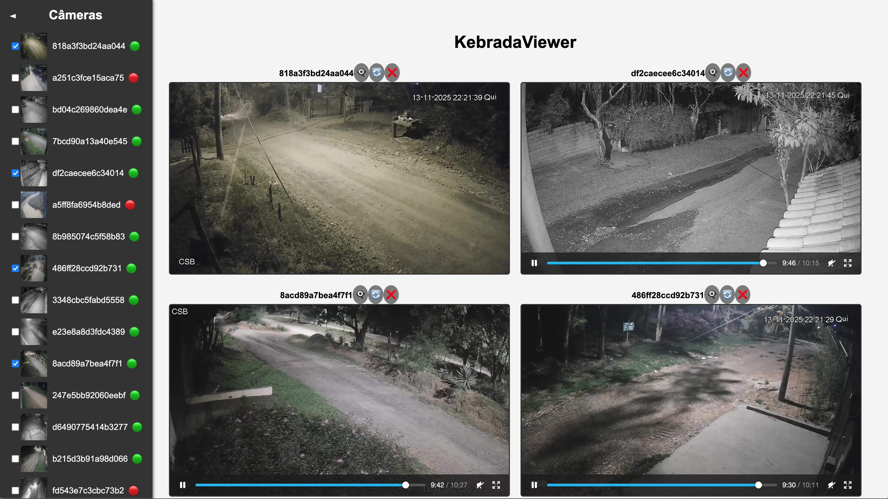

# 📺 KebradaViewer

Projeto para streaming e manipulação de vídeo usando TypeScript, Express, React e Vite.

## 📝 Descrição

Este projeto permite criar uma aplicação web para **visualizar e manipular streams de vídeo**, utilizando tecnologias modernas como React para o frontend e Express para o backend.  
Inclui suporte para **HLS**, integração com **ffmpeg** e consumo de APIs. 🚀

## 🧪 Tecnologias Utilizadas

- **TypeScript** 🧩
- **React** ⚛️
- **Express** 🚂
- **Vite** ⚡
- **HLS.js** 🎞️
- **Axios** 🌐

## 📜 Licença

Este projeto está licenciado sob a MIT License.

**Desenvolvido com 💖 por HeitorLM**